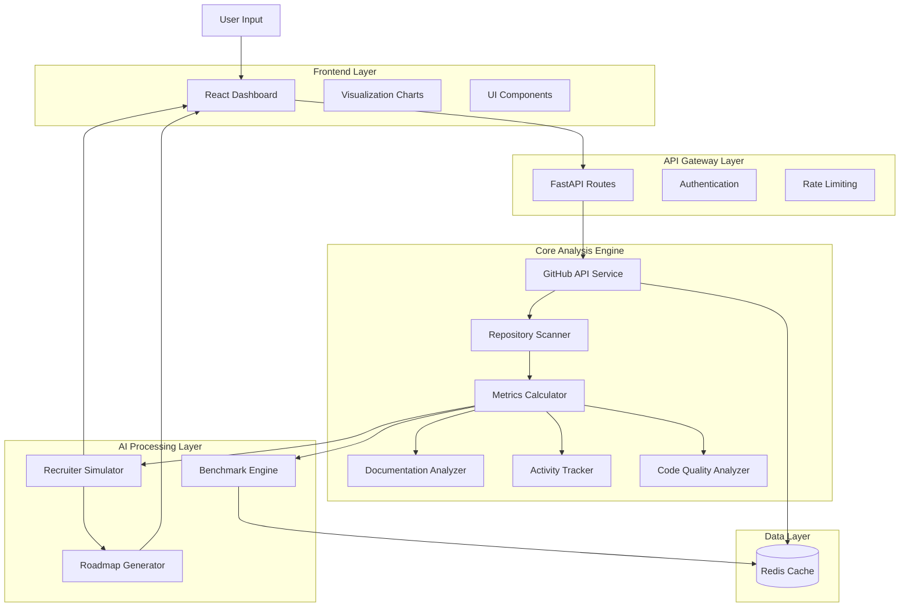
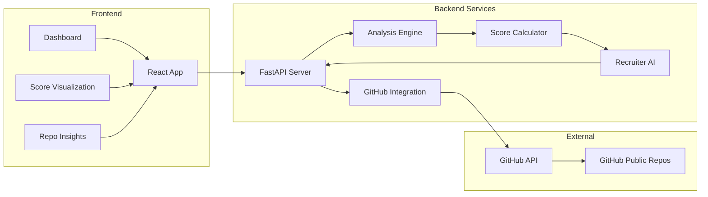
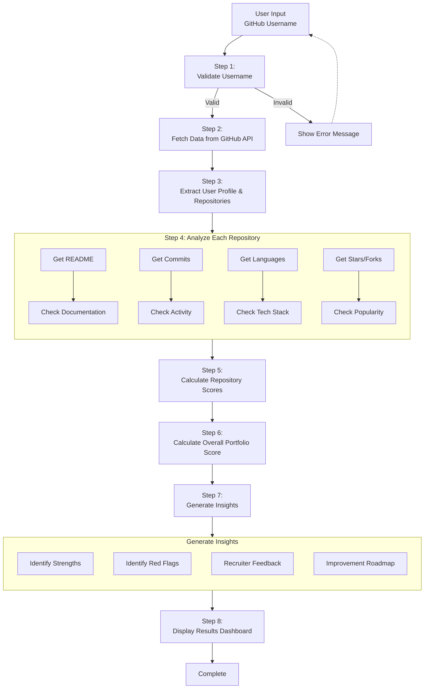
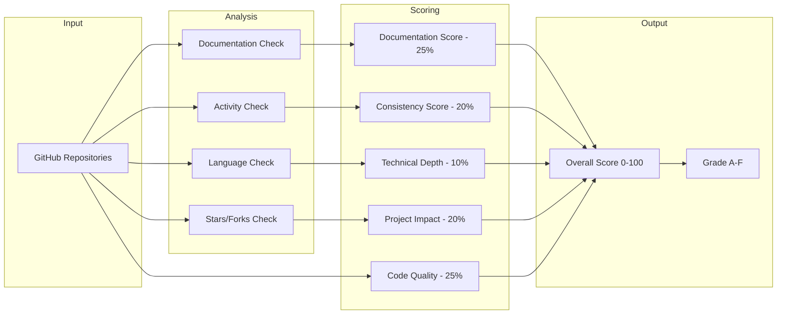
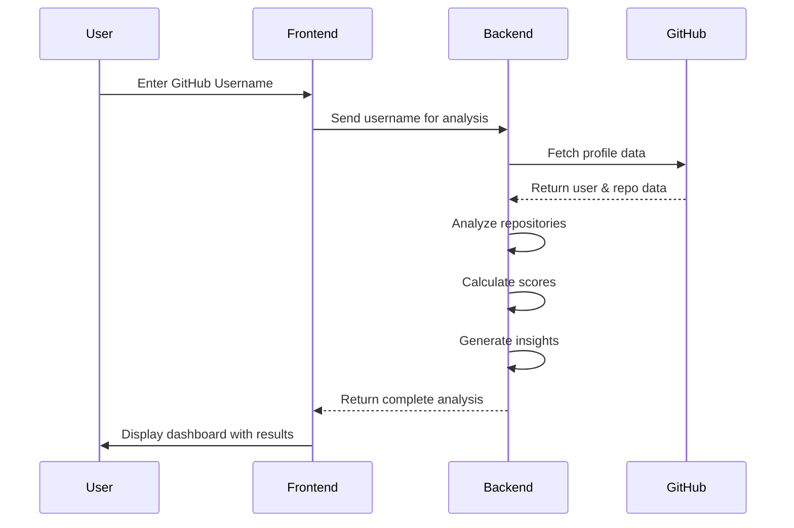
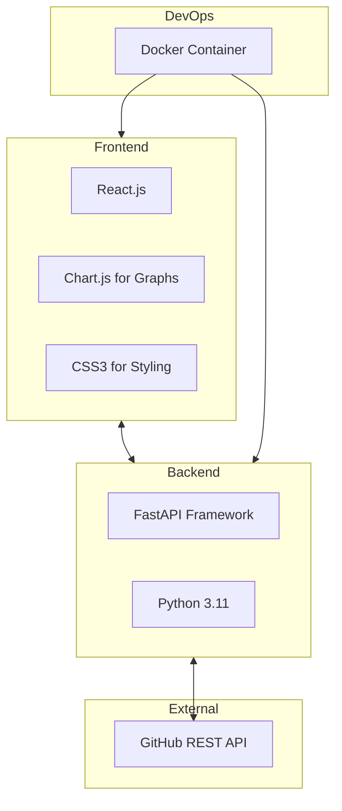

#  GitHub portfolio analysis tool

<div align="center">
  
  
  
</div>

<br>

<div align="center">
  <h3>🚀 Transform your GitHub profile into a recruiter-ready portfolio</h3>
  <p>Automated analysis • Portfolio Scoring • AI Recruiter Simulation • Improvement Roadmaps</p>
</div>

---

##  Overview

**GitHub Portfolio Analyzer & Enhancer** is an intelligent tool designed to help students and early-career developers optimize their GitHub profiles for recruitment. Most GitHub profiles fail to effectively communicate real skills, project impact, and development consistency to recruiters due to poor documentation, unstructured repositories, and unclear commit history.

Our solution automatically analyzes GitHub profiles, evaluates repositories using recruiter-relevant metrics, generates a comprehensive Portfolio Score, and provides actionable recommendations to transform a simple code storage platform into a powerful, recruiter-ready portfolio.

###  Key Features

| Feature | Description |
|---------|-------------|
| **Automated Profile Analysis** | Scans public GitHub profiles using GitHub API |
| **Portfolio Scoring** | Generates overall and component-wise scores (Documentation, Code Quality, Consistency, Impact, Depth) |
| **Repository Insights** | Individual scores and improvement suggestions for each repo |
| **Strengths & Red Flags** | Identifies what to showcase and what to fix |
| **AI Recruiter Simulation** | First impression, hire/maybe/reject decision, interview questions |
| **Improvement Roadmap** | Step-by-step plans for 7, 30, and 90 days |
| **Benchmark Comparison** | Compare with average and top-performing profiles |

---

## drive link 
https://drive.google.com/file/d/13ANO2Hzgun5eFPFOYru3UaUUbHFdY2Ry/view?usp=drive_link


##  System Architecture

### High-Level Architecture



## Component Architecture




## Data Flow Diagram




 ## Simplified Scoring Flow





| Score Range | Grade | Meaning |
|------------|-------|---------|
| 90–100 | A  | Excellent – Recruiter-ready |
| 80–89 | B  | Very Good – Minor improvements |
| 70–79 | C  | Good – Several areas to improve |
| 60–69 | D  | Fair – Significant work needed |
| 0–59 | F  | Needs complete overhaul |


## User Interaction Flow



## Technology Stack


## 📁 Project Structure

```
github-portfolio-analyzer/
├── .qoder/                    # Qoder IDE configuration
│   ├── agents/               # Custom AI agents
│   └── skills/               # Custom skills
├── backend/                  # Python FastAPI Backend
│   ├── app/                 # Main application package
│   │   ├── api/             # API routes and endpoints
│   │   │   └── routes.py    # Main API router with /analyze and /user endpoints
│   │   ├── models/          # Data models and schemas
│   │   │   └── user_profile.py  # UserProfile Pydantic model
│   │   ├── services/        # Business logic services
│   │   │   ├── analyzer_service.py    # Repository analysis logic
│   │   │   ├── github_service.py      # GitHub API integration
│   │   │   ├── recruiter_simulator.py # Recruiter feedback generation
│   │   │   ├── roadmap_generator.py   # Improvement roadmap creation
│   │   │   └── score_calculator.py    # Portfolio scoring algorithm
│   │   ├── utils/           # Utility functions
│   │   │   └── helpers.py   # Helper functions (username validation, etc.)
│   │   ├── config.py        # Configuration and environment variables
│   │   └── main.py          # FastAPI application entry point
│   ├── .env                 # Backend environment variables
│   ├── Dockerfile           # Backend Docker configuration
│   └── requirements.txt     # Python dependencies
├── frontend/                # React Frontend
│   ├── public/              # Static files
│   │   └── index.html       # Main HTML template
│   ├── src/                 # Source code
│   │   ├── components/      # React components
│   │   │   ├── ComparisonChart.js      # Score comparison visualization
│   │   │   ├── Dashboard.js            # Main dashboard layout
│   │   │   ├── Header.js               # Navigation header
│   │   │   ├── Loader.js               # Loading spinner component
│   │   │   ├── RecommendationsPanel.js # Quick actions/recommendations
│   │   │   ├── RecruiterFeedback.js    # Recruiter simulation display
│   │   │   ├── RepositoriesList.js     # Repository analysis results
│   │   │   ├── Roadmap.js              # Improvement roadmap timeline
│   │   │   └── ScoreCard.js            # Portfolio score visualization
│   │   ├── services/        # API service layer
│   │   │   └── api.js       # Axios HTTP client configuration
│   │   ├── styles/          # CSS styles
│   │   │   └── App.css      # Main stylesheet
│   │   ├── App.js           # Main React application component
│   │   └── index.js         # React entry point
│   ├── .env                 # Frontend environment variables
│   ├── Dockerfile           # Frontend Docker configuration
│   ├── package.json         # Node.js dependencies and scripts
│   └── package-lock.json    # Locked dependency versions
├── docker-compose.yml       # Docker Compose configuration
└── README.md                # This documentation file
```


## 🛠 Development Commands

### Running Both Services Simultaneously
To run both backend and frontend servers at the same time, you can use:

#### Option 1: Concurrent Terminals
1. Open two separate terminal windows/tabs
2. In the first terminal (from the `backend` directory):
   ```bash
   uvicorn app.main:app --host 0.0.0.0 --port 8000 --reload
   ```
3. In the second terminal (from the `frontend` directory):
   ```bash
   npm start
   ```

#### Option 2: Using concurrently (if installed)
If you have `concurrently` installed globally:
```bash
npm install -g concurrently
concurrently "cd backend && uvicorn app.main:app --host 0.0.0.0 --port 8000 --reload" "cd frontend && npm start"
```

#### Option 3: Using a package.json script
Add this to your root `package.json` (create one if it doesn't exist):
```json
{
  "scripts": {
    "dev": "concurrently \"cd backend && uvicorn app.main:app --host 0.0.0.0 --port 8000 --reload\" \"cd frontend && npm start\""
  }
}
```
Then run:
```bash
npm run dev
```

### Backend Development
```bash
# Run backend with auto-reload
cd backend
uvicorn app.main:app --host 0.0.0.0 --port 8000 --reload

# Run tests (if available)
cd backend
pytest
```

### Frontend Development
```bash
# Start development server
cd frontend
npm start

# Build for production
cd frontend
npm run build

# Run tests (if available)
cd frontend
npm test

# Lint code
cd frontend
npm run lint
```

## 📖 API Endpoints

- `GET /` - Root endpoint with API information
- `GET /api/v1/health` - Health check
- `GET /api/v1/analyze/{username}` - Analyze a GitHub profile
- `GET /api/v1/user/{username}/basic` - Get basic user profile information

## 🔍 Troubleshooting

### Common Issues

1. **"Failed to analyze profile" Error**
   - Ensure your GitHub token has the required permissions
   - Check that the backend server is running
   - Verify network connectivity to GitHub API

2. **"Network error: Could not reach the server"**
   - Confirm backend server is running on port 8000
   - Check that the frontend environment variable `REACT_APP_API_URL` points to the correct backend URL

3. **CORS Issues**
   - The backend is configured to allow requests from `http://localhost:3000`
   - If running on a different port, update the CORS configuration in `backend/app/main.py`

4. **Rate Limiting**
   - GitHub API has rate limits (5,000 requests per hour for authenticated requests)
   - If you hit the rate limit, wait for the reset time or use a different token

### Backend Server Not Starting
```bash
# Check if port 8000 is already in use
netstat -ano | findstr :8000

# Kill process on port 8000 (replace PID with actual process ID)
taskkill /PID <PID> /F
```

### Frontend Server Not Starting
```bash
# Clear npm cache
npm cache clean --force

# Delete node_modules and reinstall
rm -rf node_modules package-lock.json
npm install
```
